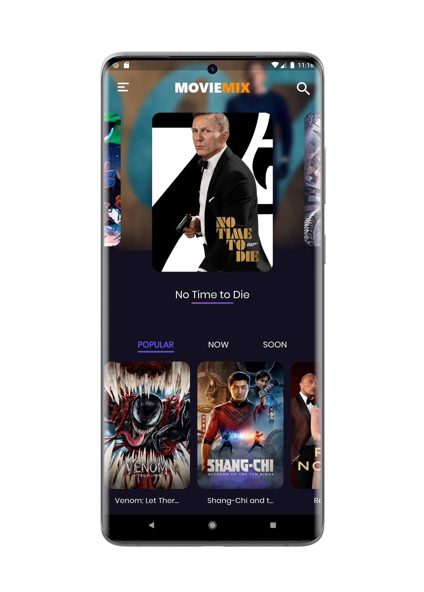
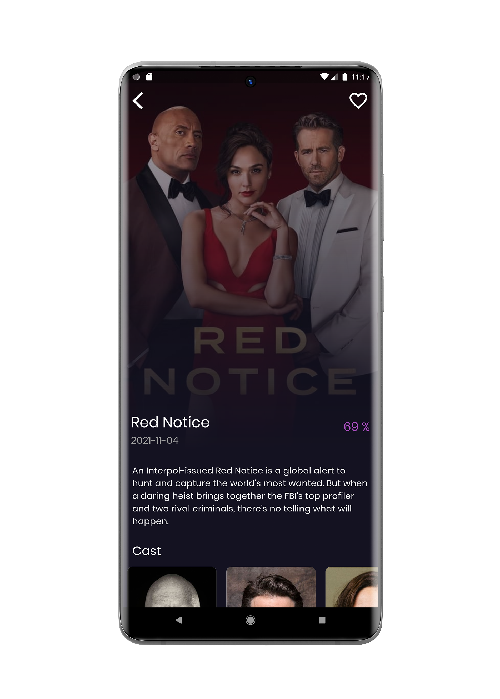
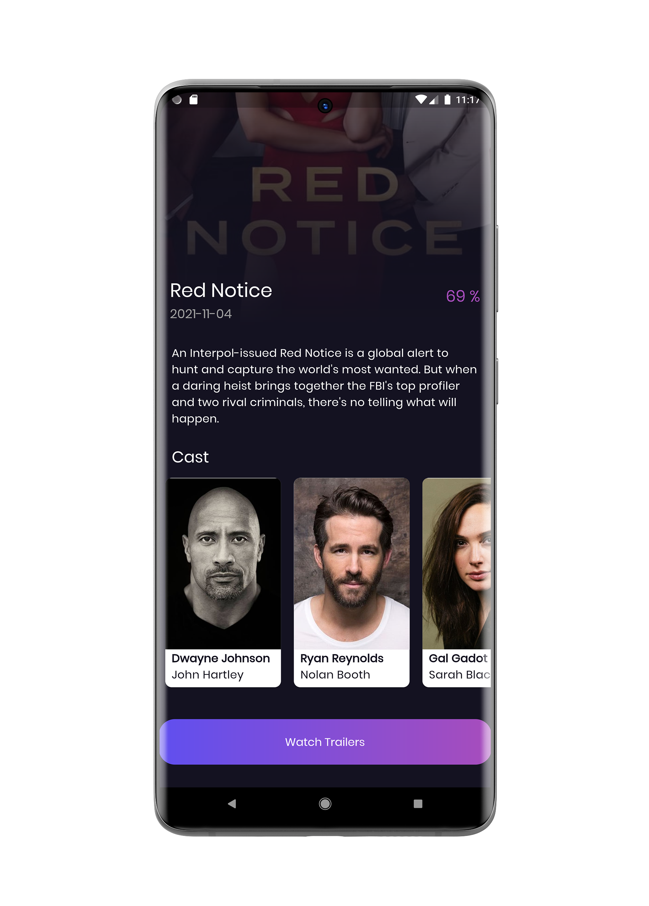
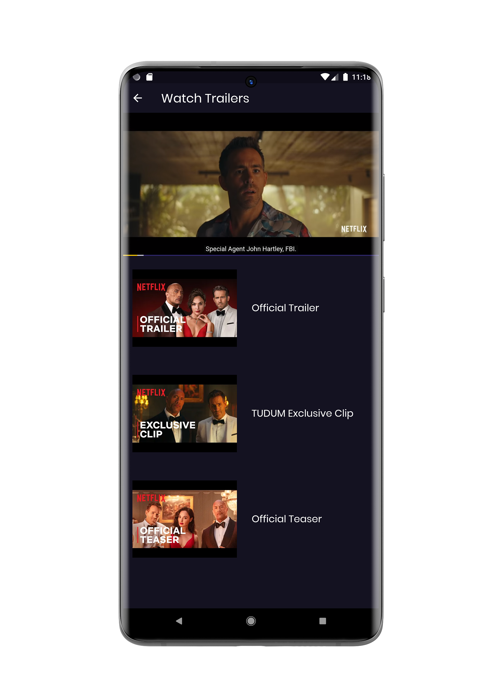
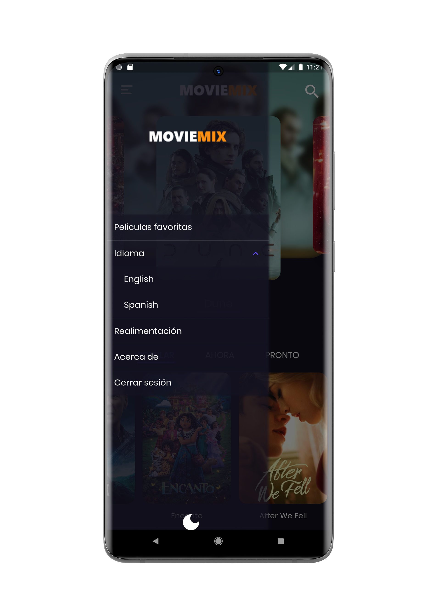
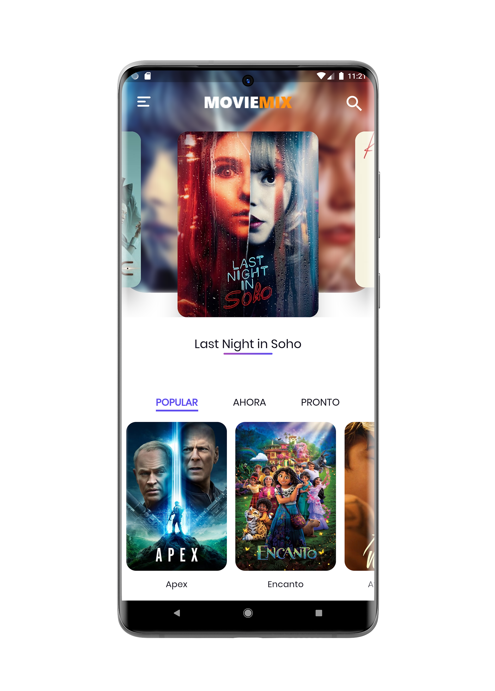

# Movie Mix

It's a movie application that I have created by using the Flutter framework. I am developing an application for learning clean architecture concepts in flutter.

## Highlights

- It is based on Clean Architecture
- Used TMDB API for movies database
- Intensively used Bloc for state management
- Implemented "get" HTTP requests for various API calls like for Trending, coming soon, popular movies, etc.
- Implemented user Authentication
- Implemented "post" HTTP request in Authentication
- Added movies searching
- Has multiple language support (English, Spanish)
- Added feedback system using wiredash
- Has the support of local database storage using Hive
- Implemented favorite movies feature
- Many more to come.

## Images

#### Home Screen

#### Detail Screen

#### Detail Bottom Screen

#### Watch Trailer Screen

#### Drawer

#### Home Screen Light Theme

